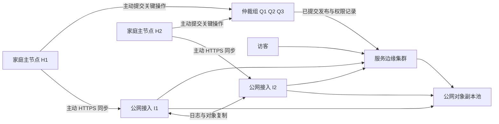
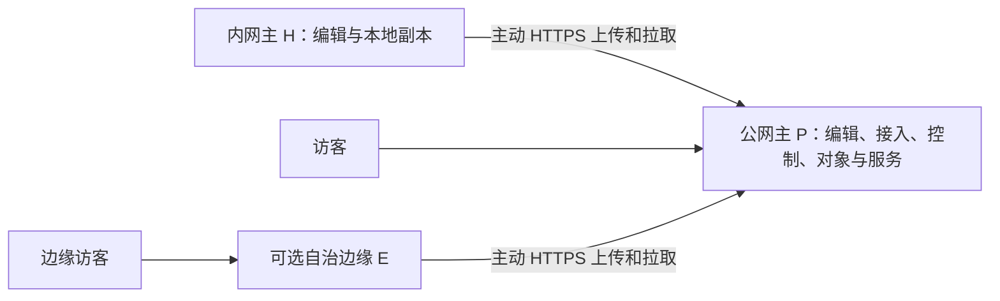

# 面向受限家庭网络与多主节点的边缘同步协议设计

状态：协议设计及 WESP v1 基线实现，已在本地双实例验收，尚未生产部署或经过真实公网验证；分页清单、签名检查点和正式仲裁仍属后续工作。日期：2026-09-09。

### 主节点主动轮询通道

当主节点处于多层 NAT 后、边缘节点位于公网时，两端启用
`WINDBLOG_WESP_ACTIVE_POLL_ENABLED=true`。主节点配置公网边缘节点的
`WINDBLOG_WESP_PEER_URL` 和共享认证令牌；边缘节点的 peer URL 必须留空。
主节点持续向边缘节点的 `GET /sync/v1/active-poll/next` 发起最长 25 秒的等待请求，
收到边缘节点排队的回源请求后在本机执行，再以自己发起的
`POST /sync/v1/active-poll/results/{id}` 返回结果。连接中断后主节点重连；
边缘节点没有近期主节点轮询时立即返回 503，不尝试直连主节点。
边缘节点在此模式下也不启动 WESP 定时出站同步，公开数据由主节点主动推送，
边缘节点产生的操作由主节点主动拉取。每个边缘节点最多同时排队 64 个回源请求，
单个请求等待上限 70 秒。生产环境的边缘节点应只暴露公网 WESP 入口，
主节点不需要任何公网入站映射。

管理端连接引导也支持此模式：在主节点启用主动轮询后，从主节点连接公网边缘节点，
引导请求不会把主节点地址写入边缘节点配置；主节点保存边缘节点 URL 供后续出站连接。
`WINDBLOG_WESP_ACTIVE_POLL_TARGET_NODE_ID` 可在手工配置主节点时指定边缘节点 ID，
用于管理端在线状态更新。连接引导会自动保存这个 ID。

本文将协议暂命名为 WESP（WindBlog Edge Synchronization Protocol）v1。默认用一台内网主 H 和一台公网主 P 组成双主网络，支持内网仅出站、上行受限和长期离线；可按需要增加保留本地自治能力的边缘节点。这里的“主节点”表示具有创作和计算能力的写入节点，不代表全局唯一数据库主库。本文包含低成本部署档位及 v1 报文约束；实现覆盖范围和未完成能力见第 16 节。

## 1. 设计结论与适用边界

采用应用层异步复制：家庭节点主动通过标准 HTTPS 与公网接入节点交换操作日志和不可变内容块；上传一次，由公网节点完成后续复制。公众访问、媒体下载和可延迟的用户写入在边缘处理，不与家庭节点建立实时请求链。

针对 GFW 或其他网络设备可能识别、阻断隧道流量的问题，协议不依赖 frp、自定义 TCP 握手、端口转发或无限持续的双向字节流，而使用真实的 HTTP 请求、对象上传、条件查询和有限批次。这样可以去除对特定隧道协议的依赖，但不能保证 HTTPS 不被识别、限速或封锁。IP、域名、TLS 握手信息、连接时长、方向和流量规模仍可能被观察；443 端口和加密不等于不可识别。

速率硬上限与计费流量上限无法通过协议突破。可优化的是减少重复上传、将分发移出家庭宽带、优先传必要数据，并在预算耗尽时保留待同步工作。如果所有可用公网入口均不可达，协议进入离线工作状态，无法承诺实时同步。本文不假定某运营商或地区当前采用特定识别规则。

主要保证：

- 家庭节点不需要公网 IP、入站端口、NAT 打洞或固定在线时段。
- 已完整发布的公共内容，在全部家庭节点离线时仍可由健康边缘服务。
- 网络恢复后，重复、乱序和中途失败的传输可恢复；业务效果通过幂等约束避免重复。
- 多主节点允许离线创作；并发正文不静默覆盖，关键权限和正式发布采用仲裁。
- 单个家庭节点通常只上传一份新增内容，副本扩散消耗公网节点带宽。

不保证：无限离线后的无成本恢复、网络分区期间全局强一致与任意写入同时成立、未上传数据的容灾、流量无法分类、付费内容撤权在断网边缘立即生效。

## 2. 节点角色与拓扑



箭头表示连接发起方向或公网复制方向；公网节点不能反向连接家庭节点。H1、H2 无需相互可达，它们通过接入层间接交换操作。以上角色可共机，但同一主机或同一存储卷不能被计为独立故障域。

| 角色 | 持久状态 | 职责 |
| --- | --- | --- |
| 写入节点 H/P | 本地数据库、事务 outbox、对象缓存、同步游标 | 独立编辑、生成事件、合并其他写入者修改 |
| 接入节点 I | 接收日志、收件箱、块存储、复制回执 | 认证、去重、落盘、分发和故障恢复 |
| 服务边缘 E | 已发布视图、必要媒体、用户写入队列 | 独立读服务、提交评论等业务意图 |
| 仲裁组 Q | 共识日志、成员身份、权限版本、发布头 | 关键状态线性化提交、防止双重发布和重复执行 |
| 对象副本池 O | 按内容寻址的块与清单 | 公网复制、恢复、媒体交付 |

上图是逻辑角色示意，不是建议采购清单。默认采用下面的两机拓扑，I/E/Q/O 合并在公网主 P，不要求专用服务器。物理可达性、写入权限和服务能力是独立属性，不能由一个 primary/edge 枚举推断全部权限。

### 2.1 内网主与公网主：默认两机部署



同步箭头是连接发起方向，响应可携带反向数据。H→P 同样可下载 P 的修改；P 不回连 H。P 是完整写入主节点，有自己的 actor/outbox，其编辑与 H 遵循同样的因果及冲突规则。H 离线时 P 可正常创作与发布；P 不可达时 H 可本地创作，恢复后双向补齐。

| 档位 | 物理节点 / 付费公网服务器数 | 能力与代价 |
| --- | --- | --- |
| A，默认 | H + P / 1 台 | 双主创作、P 独立发布服务；P 故障时没有其他公网入口 |
| B，服务冗余 | H + P + E / 2 台 | E 完整公共副本可离网自运行；P 故障仍可读，全局关键写入暂停 |
| C，控制高可用 | H + P + E1 + E2 / 3 台 | P/E1/E2 组成三成员控制组，两成员健康互通可提交 |

优先 A；需要 P 维护或故障时仍有公网读服务选 B；关键写入也必须自动容错才选 C。已有边缘可复用。B 的两个公网节点不能在任一机失效后同时保证多数派写入和无脑裂；无需为了节点数“对称”把 H 纳入在线仲裁。

A/B 使用 `authority_mode=single`：P 的数据库事务、唯一约束和 CAS 串行化发布、权限及任务租约。H/P 都能提交创作操作，P 独占全局控制提交权。C 使用 `authority_mode=quorum`。后文 Q 在 A/B 指 P 内部控制模块，在 C 指多数派；“无多数派”在 A/B 等价于控制模块不可达。

P 失效后不能仅凭超时自动把 H/E 提升为控制主。人工迁移必须先隔离旧控制节点的写入口及执行凭据，恢复可确认的控制日志、提升 authority epoch，并向继续服务的节点分发新信任配置；无法证明旧节点已隔离则保持关键写入冻结。旧 epoch 节点重新接入时仅可导出待合并内容，不能提交控制状态。

### 2.2 成本、存储副本与扩容

A 的块存储使用 P 本地持久卷，outbox/inbox 和任务调度使用已有数据库，不为本协议新增专用消息队列、缓存、对象网关或发现服务器。H 保留原件并主动下载 P 新增内容作为备份；尚未下载的 P 新内容只有一份。

#### 2.2.1 轻量自治边缘包（推荐 E 档）

E 不再按完整 WindBlog 主节点部署。部署包固定使用 `edge` 构建 profile 和
`native-micro` 镜像，只保留公开读服务、WESP 主动同步、本地媒体块存储、PostgreSQL
元数据和 Redis 热缓存；RabbitMQ、Elasticsearch、Codex Creator、ClamAV、管理端的
重型任务和搜索集群均不随包部署。数据库使用 `postgres:18-alpine`，不需要 pgvector；
数据库与 Redis 仅在 Compose 内部网络可见，边缘宿主机默认只公开 HTTP；兼容旧 gRPC
端口仅绑定回环地址，只有回滚并配置防火墙后才显式改为公网绑定。

这里的“轻量”是运行时与拓扑轻量：native runner 仍复用同一 WindBlog 代码库，因而不会
误称为另一个完全裁剪的业务二进制。若未来要进一步降到单进程/无数据库代理，需要另建
`edge-agent` 模块并定义独立的本地查询与附件缓存接口；本版本不把该工作隐含在部署脚本中。

边缘包为应用、数据库、缓存和数据卷设置保守的默认资源上限（合计约 1.75 CPU / 736 MiB），
并把上传文件、WESP 块、WESP 配置、节点 RSA 密钥和数据库分别持久化。该档位仍保留本地数据库，因而
可在 P 离线时继续提供已发布内容和排队写入；它不是无状态 CDN，也不会把未同步数据
伪装成已完成复制。确需全文搜索或完整管理能力时，显式选择完整节点镜像，不应把轻量
包的资源上限静默放宽。

下载的 ZIP 包包含 `deploy.sh`。在目标机解压后执行 `bash deploy.sh` 即会自动选择
Docker Compose/Podman Compose、拉取三个镜像、创建卷、启动服务并等待 readiness；
`bash deploy.sh status|logs|stop` 用于日常运维。脚本不向公网暴露数据库、Redis 或旧
gRPC，也不要求家庭节点开放入站端口。

`required_public_copies` 在 A 默认 1，在 B/C 默认 2。H 的副本另计 `home_backup_complete`，不能替代公网服务副本。同机角色和 CDN 缓存不算独立持久副本。A 可以单公网副本发布，但必须展示该耐久性级别；B/C 副本不足时等候，不能静默降低要求。外部备份是可选成本项，不是免费的隐藏服务器。

P 新增内容不绕行 H；H 上传一次至 P，P 分发到 E。双主模式中 H 是唯一需要配置 `peer-url=P` 的内网主动客户端：H 同时上传自己的 outbox 并从 P 的变更日志拉取 P 的修改；P 无需、也不应配置指向 H 的 peer URL，因为 H 没有入站服务。自治 E 同样配置 `peer-url=P` 并主动拉取。N 个节点默认 N−1 条以 P 为中心的逻辑同步关系，避免全互联；仅在缺块修复或 P 故障时启用经授权的备用对等连接。B 的访客切换还需预配置 DNS/客户端入口，受缓存和探测时延影响，不由同步协议自动保证。

总成本为服务器固定费、存储与备份费、出口字节费、请求费及运维成本之和。无供应商实时报价假设。先测 P 的容量、出口、请求时延及可接受停机时间，再决定是否增加 E；冷历史可选择性复制，但自治服务集必需内容必须常驻，不能省盘后仍声称具备完整离网能力。

可选部署境内接入节点，再由公网节点向其他区域同步，从而把家庭上传路径与跨区域复制路径分开。这只是可选拓扑，取决于实际可达性、存储与带宽成本，不能保证跨区域路径可用。

## 3. 数据模型与协议不变量

### 3.1 操作信封

每个操作包含：

| 字段 | 语义 |
| --- | --- |
| `protocol_major`, `schema_version` | 协议及业务载荷版本 |
| `tenant_id`, `dataset_id` | 隔离边界与复制范围 |
| `actor_id`, `incarnation`, `seq` | 节点身份、实例世代、世代内单调序号 |
| `op_id` | 上述隔离域与三元组的组合键 |
| `entity_id`, `entity_type`, `operation` | 全局随机 UUID 实体标识和类型化操作 |
| `context` | 已观察的版本向量；按 actor/世代记录连续序号 |
| `hlc` | 混合逻辑时钟，仅作展示和诊断，不单独决定胜负 |
| `payload_hash`, `manifest_id` | 载荷和对象清单的 SHA-256 |
| `auth_epoch`, `key_id`, `signature` | 授权世代及操作签名 |

签名覆盖规范化信封与载荷摘要，包括租户、数据集和版本。JSON 使用 RFC 8785 的规范化规则，整数序号在 JSON 中编码为十进制字符串，避免客户端数值精度丢失。对签名载荷限制长度、嵌套深度和向量规模。

本地业务修改、序号分配与 outbox 写入必须在一个数据库事务中完成。网络发送位于事务之外。恢复旧备份、克隆机器或丢失序号状态时必须创建新 incarnation 并重新登记，禁止沿用旧世代产生相同 op_id。离线期间可生成新世代草稿，但注册前不能导入全局日志。

### 3.2 必须保持的不变量

1. 同一 op_id、相同摘要重复提交返回原结果；同一 op_id、不同摘要返回冲突并隔离该写入者。
2. 接收确认只能在事件及其必要元数据持久化后发出；接收、异地复制、业务应用和公众可见是不同状态。
3. 已发布视图只能引用校验完成且达到发布副本要求的对象。
4. 不以墙上时钟判定并发覆盖，不以“当前在线者”自动获得全部写权限。
5. 家庭离线不触发边缘清空、反复回源或下架完整的公共快照。
6. 未知必需字段、未知操作类型或缺少因果依赖的事件不能推进“已应用”水位。
7. 私密草稿、凭据、会话和公开内容属于不同复制集合，禁止随全站快照混传。

## 4. 连接与请求设计

基线为 TLS 1.3 + HTTPS/HTTP/2，兼容 HTTP/1.1；使用经过维护的标准客户端和真实证书验证。HTTP/3 可作为经过测量后启用的能力，不能成为唯一传输方式，因为它依赖 UDP。HTTP 与 QUIC 的具体语义参见文末标准。

使用有限批次上传、短轮询或最长 25 秒的可选长轮询。允许连接复用，连接关闭不影响同步正确性。不伪装浏览器指纹，不需要随机垃圾填充；这些做法会增加复杂度或计费流量，也无法提供不可识别保证。退避抖动用于避免重连风暴。

所有以下路径是协议接口；当前仓库已提供会话、批次、变更、库存、块和回执的基线 HTTP 资源，意图与签名检查点仍需后续实现：

| 接口 | 请求/结果 | 正确性要求 |
| --- | --- | --- |
| `POST /sync/v1/sessions` | 身份证明、能力、游标；返回会话、限额和服务端水位 | 会话可重建，不承载唯一恢复状态 |
| `POST /api/admin/edge-nodes/connection/bootstrap` | 已登录目标管理员写入本地 WESP 运行配置 | 仅接受目标 Admin JWT + step-up；响应不得返回 token |
| `POST /sync/v1/inventory` | 分页清单和对象摘要；返回准确缺失列表 | 库存结果只是提示，提交时重新检查 |
| `PUT /sync/v1/blocks/{hash}` | 上传一个完整块 | 哈希、长度和租户授权校验；幂等 |
| `GET /sync/v1/blocks/{hash}` | 下载块，可使用 Range | 强 ETag 绑定字节表示；范围错配则重取 |
| `PUT /sync/v1/batches/{batch_id}` | 不可变操作批次及清单 | 返回逐操作状态；重复批次不得改变内容 |
| `GET /sync/v1/changes?after=...` | 拉取变更、业务意图和 next_cursor | 游标不代替本地事务应用确认 |
| `PUT /sync/v1/receipts/{receipt_id}` | 报告持久化、复制或应用水位 | 回执可重复，连续水位不能越过缺口 |
| `GET /sync/v1/snapshots/{id}` | 获取不可变快照清单 | 清单签名、摘要及检查点匹配 |
| `PUT /sync/v1/intents/{id}` | 提交发布、审核或用户写入意图 | 对相同幂等键返回同一业务结果 |
| `GET /sync/v1/intents/{id}` | 查询排队、拒绝或已提交结果 | 不把 HTTP 接收成功显示成发布成功 |

分页游标绑定节点日志世代、租户和过滤集合，必须不透明且带完整性保护。切换接入节点后，不能复用另一节点的局部游标；以版本向量、精确缺口或快照重新协商。

错误处理：401 刷新认证或重新登记；403 停止越权任务；409 获取冲突或缺失依赖；410 表示检查点已淘汰、进入快照恢复；413 缩小批次；429/503 尊重 Retry-After 并退避；507 暂停向该节点上传并切换已授权入口。错误响应区分可重试、需人工处理和永久拒绝。

空闲轮询采用 ETag/304，但 304、请求头和 TLS 握手仍计入预算。控制接口响应禁止共享缓存；只有公开不可变对象可交给 CDN。上传块用完整 PUT；v1 不把 HTTP Range 当作标准断点上传机制，中断只重传未确认的小块。

### 4.1 报文编码与硬限制

本节“必须/禁止”为 WESP v1 互操作约束，不能由实现自行放宽；协商只允许降低上限。协议定义的是 HTTP 应用报文，不假设 TCP 分段边界，一个请求对应一个完整 JSON 对象或一个二进制块，不使用拼接 JSON、无限 NDJSON 或任意流复用。

| 项目 | v1 约束 |
| --- | --- |
| JSON | UTF-8、无 BOM、顶层对象；拒绝重复键、非法 Unicode、NaN/Infinity；最大嵌套 16 层 |
| 媒体类型 | 控制 `application/json`；块 `application/octet-stream`；不匹配返回 415 |
| 压缩 | 基线必须支持 identity；gzip 仅协商后使用，禁止嵌套编码；解压大小及 32 倍倍率双重限制 |
| 控制报文 | 编码前及解压后均不超过 1 MiB；单事件规范化后不超过 64 KiB；正文较大时引用对象 |
| 二进制块 | 原始字节 1–2,097,152；默认 524,288；空文件用零项清单表示且 file_hash 为 SHA-256(空字节) |
| HTTP 头 / 路径及查询 | 总头部最大 16 KiB，单字段最大 4 KiB；request-target 最大 4 KiB |
| 批次 / 清单分页 | 每批最多 256 操作；每页最多 1024 块条目，且仍受 1 MiB 限制 |
| 因果向量 | 每数据集最多 128 个 actor/世代项，排序且不可重复；超限要求检查点，不得截断 |
| 字符串 | 普通标识最大 128 ASCII 字节；不透明游标最大 2048 字节；错误说明最大 512 UTF-8 字节 |
| 整数 | seq/epoch/offset/size/时钟均为无前导零的十进制字符串，范围 0..2^63−1；seq 从 1 开始 |
| 摘要 | SHA-256 小写十六进制，恰好 64 字符；UUID 为小写带连字符形式 |
| 签名 | 基线 HMAC-SHA256 小写十六进制（64 字符）；受控部署可协商 Ed25519（64 字节、无填充 base64url 86 字符）；key_id 绑定登记密钥 |

HTTP 框架负责标准 framing；代理与应用必须使用一致的长度解析，拒绝歧义 Content-Length、冲突的 Transfer-Encoding 与截断消息。读到超过上限立即停止并返回 413，不等待完整 body；413 在认证和业务校验之前即可触发，不能留下已提交的半条事件。

协议主版本在路径 `/v1/` 与 `protocol_major=1` 中必须一致。次版本通过会话协商，必需能力不受支持则返回 `UNSUPPORTED_CAPABILITY`，禁止静默忽略。核心对象未知字段返回 422；未来可选字段只能放进 `extensions`（总计最多 4 KiB），不理解的非关键扩展可忽略，但仍参加签名。`required_capabilities` 列出的扩展必须被理解。

所有请求携带 `X-WESP-Request-Id`（UUID）；除首次凭据登记外均需身份认证。会话返回的 token 只能发给已登记 HTTPS origin；收到重定向不得自动转发 Authorization。响应回显 request_id。代理路由不能把请求头中的 actor 声明当成已认证身份。

### 4.2 会话、操作与响应结构

会话请求必填 `protocol_major`、`protocol_minor`、`node_id`、`incarnation`、`capabilities`、`datasets` 和 `limits`；datasets 每页最多 64 项，每项含 dataset_id、接收水位、应用水位及可选游标。响应必须含 `session_id`、已选能力/限制、`authority_mode`、`authority_epoch`、授权数据集、`required_public_copies`、`retry_after_seconds`。会话有效期默认 1 小时，会话过期不删除上传进度，离线本地服务也不依赖会话续期。

操作采用 `{"signed": {...}, "signature": "..."}` 外层结构，signature 不参与自身签名；基线签名字节为 `HMAC-SHA256(shared_token, UTF-8("WESP/1/op\n") || JCS(signed))`，Ed25519 配置使用相同域前缀和输入。signed 必须包含第 3.1 节字段（signature 除外），另含 `payload`、`required_capabilities` 和 `extensions`；无媒体时 manifest_id 为 null，无扩展时为 `{}`。payload_hash 为 JCS(payload) 的 SHA-256。控制发布、回执和检查点分别使用 `WESP/1/release\n`、`WESP/1/receipt\n`、`WESP/1/checkpoint\n` 域前缀，防止跨类型重放；这些是前缀中的单个 LF 字节，不是字面反斜线加 n。

op_id 可采用 `tenant_id/dataset_id/actor_id/incarnation/seq` 的可复算形式，也可采用随机 UUID；接收方只按不透明唯一值去重，最大 200 ASCII 字符。context 是按 `(actor_id, incarnation)` 排序的 `{actor_id, incarnation, seq}` 数组；本 actor 的 context 必须包含 seq−1（首条可省略零项）。hlc 是 `{physical_ms, logical}` 对象，两个成员均为整数串。同一事件必须保持逐字节语义不变地转发，不能由中继替换 context、签名或载荷。

实现保留一个控制事件 `entity_type=SYNC_REQUEST`、`operation=UPSERT` 用于全量重放。其 payload 必须包含目标 `target_node_id`、模式 `mode=FULL`、布尔 `force`，以及由目标节点 peer URL 确定的 `peer_id`（公网 peer URL 的 SHA-256）。接收端只接受目标节点自身的请求，将该 peer 的本地游标标记为待重置；下一次主动拉取从游标 0 开始，重复操作按 op_id/摘要幂等处理。

下例仅展示结构，尖括号为占位符，不是可验签的测试向量；所有实际值必须满足上述格式与摘要约束。

```json
{
  "batch_id": "00000000-0000-4000-8000-000000000020",
  "operations": [{
    "signed": {
      "protocol_major": 1,
      "schema_version": 1,
      "tenant_id": "<tenant-uuid>",
      "dataset_id": "<dataset-uuid>",
      "actor_id": "<actor-uuid>",
      "incarnation": "<incarnation-uuid>",
      "seq": "1",
      "op_id": "<tenant>/<dataset>/<actor>/<incarnation>/1",
      "entity_id": "<entity-uuid>",
      "entity_type": "POST",
      "operation": "REVISION_CREATE",
      "context": [],
      "hlc": {"physical_ms": "1788825600000", "logical": "0"},
      "payload": {"revision_id": "<revision-uuid>", "body_hash": "<64-hex>"},
      "payload_hash": "<64-hex>",
      "manifest_id": "<64-hex-or-null>",
      "auth_epoch": "1",
      "key_id": "device-key-1",
      "required_capabilities": [],
      "extensions": {}
    },
      "signature": "<64-lowercase-hex-hmac>"
  }]
}
```

batch_id 是 UUID，路径和 body 值必须相同；批次去重摘要为完整请求 JSON 的 JCS 摘要。请求重试可换 request_id，但必须保留 batch_id、操作 ID、内容与签名。新会话和新接入节点不重置去重语义。

首次批次持久接收返回 201，重复且内容一致返回 200；两者都不表示公众可见。结构错误整批拒绝且不应用；结构合法后可逐事件接收，响应 `results` 必须逐一对应输入 op_id，状态为 `ACCEPTED_LOCAL`、`DUPLICATE`、`WAITING_DEPENDENCY`、`CONFLICT` 或 `REJECTED`，禁止只返回一个 success=true。异步业务意图返回 202。APPLIED/VISIBLE 等后续进度通过签名回执获取。

错误响应固定为 `{"request_id":"<uuid>","error":{"code":"OP_ID_CONFLICT","retryable":false,"message":"...","details":{}}}`，details 不超过 4 KiB。400 表示 framing/JSON 错误，422 表示字段或语义错误，409 表示身份/内容冲突；鉴权、限流与资源状态沿用第 4 节。不得在错误中返回正文、token、私钥或跨租户库存。

### 4.3 块、清单、恢复与回执约束

块 PUT 的 URL 摘要必须等于解码后原始字节摘要；上传流采用临时文件，长度与摘要通过后原子落入块库。重复相同块返回原对象状态；哈希不符返回 422 `HASH_MISMATCH` 并丢弃临时内容。库存查询要求 `{hash,size}` 条目，响应逐项给出 present/missing，未返回条目不能视为存在。

文件清单含 `schema_version`、`file_size`、`file_hash`、`chunking` 和有序 `blocks[{hash,size}]`；块大小之和必须等于 file_size，块原文拼接摘要必须等于 file_hash，manifest_id 是去掉自身字段后的清单 JCS 摘要。超过单页时改用根清单引用页摘要，每页至多 1024 项、根至多 1024 页，页序与块序均参加哈希；v1 单文件上限 1 TiB，禁止循环清单引用。清单是一类 JSON 对象，可通过 blocks 接口以其 JCS 字节存储。

块 GET 的 Range 仅支持单一字节区间且必须配合 If-Range/强 ETag；范围传输采用 identity，防止压缩前后偏移混淆。收到 200 必须替换此前局部缓存，不能盲目追加；416 重新校验大小与本地进度。

回执 signed 部分必填 `receipt_id`、`issuer_id`、`tenant_id`、`dataset_id`、`stage`、`subject_ids`、`manifest_id`、`authority_epoch`、`replicas`、`received_frontier`、`applied_frontier`。每页最多 256 subject_ids。stage 取 ACCEPTED_LOCAL/DURABLE_R/APPLIED/VISIBLE；replicas 每项含 node_id、failure_domain 和 verified_at。DURABLE_R 必须符合档位要求；VISIBLE 另含 release_id 与实际可见节点列表。历史回执不代替当前副本健康检查。

变更响应固定为 `items`、`next_cursor`、`has_more` 与 `server_frontier`，每页最多 256 项且不超过 1 MiB。消费者只有本地事务提交后才保存 next_cursor；空页不得凭空提高 applied_frontier。游标失效返回 410，并给出可验证 checkpoint_id 和重新协商入口，不要求删除未上传 outbox。

批次 HTTP 响应丢失时以同 ID 重试；接收去重索引保留到相关世代被正式检查点封存，之后旧世代返回 `REBASE_REQUIRED`，不能因普通 TTL 到期再次执行旧操作。签名离线事件不能因墙上时间较旧一律拒绝；授权是否有效按成员世代和导入规则校验。在线认证挑战则使用一次性 nonce 和短期有效期，防止登录证明重放。

## 5. 一次同步与确认流程

1. H 本地事务生成事件与对象引用；批处理器按优先级整理待发任务。
2. H 主动建立会话，拉取最新授权世代、能力和已知水位，先处理撤权及删除。
3. H 提交库存清单，只上传接入层缺少的块。已经在公网副本池中的内容，由公网内部补齐。
4. H 提交不可变事件批次。I 验签并落盘后返回 `ACCEPTED_LOCAL`；依赖缺失返回待补清单，不承诺可发布。
5. I 在公网复制事件与对象，达到约定故障域数量后生成 `DURABLE_R` 回执，包含清单摘要、副本身份和校验时间。
6. H 下次主动查询取得回执；达到保留策略后才允许清理本地发送缓存。用户原始文件不会仅因收到接收回执而自动删除。
7. 对普通可合并数据，E 完整应用后返回 `APPLIED`；正式发布还必须经过 Q 提交 release，再返回 `VISIBLE`，附边缘范围。
8. H 拉取其他主节点和边缘事件，在同一事务内写入 inbox 去重记录、应用结果与本地游标。提交后才发送回执。

服务端允许乱序接收，但只能推进连续持久化序号；缺失的 18 不能因收到 19 而被跳过。因果依赖未到达时暂存并请求缺口。经过认证且永久拒绝的操作可登记拒绝终态，使传输游标继续前进，但不计入业务已应用向量；依赖被拒绝操作的后续事件转为显式失败或重建。

不同数据集的向量独立，序号也按数据集分配，避免过滤订阅制造假缺口。同一数据集存在字段级过滤时必须使用独立投影日志，不能直接暴露原始日志水位。

## 6. 上行速率、数据量和断点优化

### 6.1 上传一次与内容寻址

家庭节点向一个选定入口上传，公网副本数 R 按档位取 A=1、B/C=2；R=1 没有额外公网复制步骤。故障切换前先查询新入口及公网副本池库存，不能默认全量重传。两个写入节点持有相同内容时可使用短期上传预约减少竞争，但预约不是正确性基础；超时允许接管，最后由内容哈希去重。

媒体默认按固定 512 KiB 切块，最后一块可更小，文件清单记录块序列、原始大小和摘要。小对象直接单块；断线最多损失当前未确认块。对于频繁局部修改的大文件，可后续协商内容定义分块，建议最小 128 KiB、目标 512 KiB、最大 2 MiB；分块算法及参数必须随清单版本固定。

哈希基于原始块，传输压缩是独立编码；接收方限制解压后长度并验证摘要。文本批次可协商压缩；JPEG、视频和已有压缩包默认跳过。补丁仅在接收方明确拥有基底且补丁显著更小时使用，失败退回缺块上传；v1 无需依赖补丁算法。

媒体缩略图和转码尽量在公网从已上传原件生成；算法版本、参数和输出摘要入清单。若原件没有公开或存档需求，可明确选择只同步展示版，但应在 UI 标记恢复能力降低。新内容的不可压缩字节必须至少跨家庭出口一次，除非它已经存在于公网。

### 6.2 双层预算与排队

家庭出口实行全局 token bucket，而非每连接独立限速；速率预算与月度字节预算同时生效。多个进程共享计量账本，同一路由器下的多个主节点还需共享网关限速器，或静态分配总和不超过出口上限的额度。

```text
remaining = max(0, monthly_limit - measured_egress - safety_reserve)
pace_rate = remaining / seconds_to_cycle_end
send_rate = min(configured_rate_cap, available_link_estimate, pace_rate)
```

上述均使用 bytes 和 seconds；展示 Mbps 时乘除 8。`pace_rate` 是保守均摊模式，可配置每日窗口或突发，但总账不得透支。速率估计取正常传输的有效吞吐，不反复运行耗流量的测速。

协议负载计数只作下界；应优先读取网关/WAN 计数，包含握手、请求头、TCP 重传、上传期间下载确认所需的上行 ACK 和其他设备流量。缺少网关计量时采用保守开销系数及余量，并显示“估算”。运营商账期和口径必须配置，不能假设自然月或仅统计协议进程。

优先级：P0 撤权、删除和控制回执；P1 正文、发布清单和审核结果；P2 首屏必要媒体；P3 大原件、历史归档和预热。P0 保留额度包含在月度总额内；硬额度耗尽时连 P0 也不能保证送达。队列使用加权公平调度与任务老化，避免大文件永久饥饿。

示例：新增唯一对象每天 200 MB，30 天为 6 GB。家庭逐个上传到 5 个边缘约需 30 GB；上传一次并由公网分发约需 6 GB，加控制、失败和传输开销。100 GB/月按 30 天连续均摊约为 0.309 Mbps；即使瞬时上行有 20 Mbps，持续跑满仍会很快耗尽额度。以上为十进制单位估算，不是实测值。

必要条件：长期新增唯一数据速率必须低于可用平均上传速率，否则积压必然增长。界面展示待传字节、最老任务年龄、预计清空时间、剩余额度；超负荷时延迟原件、调整保留策略或增加可用预算，不能无限堆积后仍承诺实时发布。

## 7. 离线与恢复

家庭状态机：`OFFLINE → CONNECTING → NEGOTIATING → SYNCING → IDLE`；失败进入 `BACKOFF`，预算不足进入 `BUDGET_PAUSED`，身份失效进入 `AUTH_REQUIRED`。重试采用全抖动指数退避，起始约 2 秒、上限 15 分钟；网络恢复或用户手动操作可以提前尝试，但仍受预算和服务器退避约束。

短期离线只补操作缺口和缺失对象。边缘继续使用最后完整 release，不在访客请求路径等待家庭重连。媒体缺失先找公网副本；所有公网副本都缺失时返回明确暂不可用或占位图，并异步登记补齐意图，不立即回源家庭节点。

长期离线恢复使用已签名快照：清单绑定数据集、schema、成员世代、覆盖向量、对象根摘要和删除检查点。快照从一致检查点生成；下载后在影子存储中校验、补齐快照之后的日志，再原子切换。恢复期间原有完整公开视图继续服务。

本地未上传 outbox 必须在恢复前独立保存。旧事件仍满足授权和历史窗口时正常补传；检查点已过期或身份世代已退休时，不直接重放旧事件，而是生成相对新快照的待合并草稿，由当前身份重新签发。

家庭在线只是存在新进度的信号，不是锁或选主依据。健康监控分别记录最后连接、最后持久化、最后业务应用和最后公开 release，防止“在线但未同步”被误报为正常。

### 7.1 继承边缘自治的最低契约

本次代码核对：`EdgeReadOnlyState` 在断开主节点后标记只读；`EdgeWriteRoutingFilter` 拦截大多数业务写入，但放行本地登录/登出等路径；`EdgeSyncDataApplyService` 将 POST/TAG/CATEGORY/MEDIA 等公开实体写入本地；`application-edge.properties` 禁用边缘 RabbitMQ 通道。它们支持“本地公开数据 + 离线只读”的现有设计方向；仅有登录路由放行不能证明离线鉴权依赖齐全，本文不将未运行验证的路径说成已验收。

新协议必须继承本地数据库、渲染、公开缓存及可用本地登录的能力，不得把 E 降级成必须实时访问 P 的薄代理。“离网”首先指无法联系同步/控制网络，但仍可服务能到达本机的访客；整机断网时只能服务同机/仍连通的局域网，不能保证公网访问。

自治包必须包含 active_release、文章/分类/标签/许可、模板与静态资源、服务集内必需媒体、必要的公开验证密钥、路由配置、数据库 schema 和兼容应用版本。启动不能等待 P、远程配置中心、远程 Redis、MQ 或在线许可证握手；本地缓存可重建，必要数据必须落盘。依赖外站的字体、脚本、图片或实时搜索需本地化或明确降级，远程链接不计自治完整资源。

E 的状态为 `SYNCED → ISOLATED_SERVING → RECONCILING → SYNCED`；磁盘或资源缺失时进入 `DEGRADED_SERVING`，保留尚可服务的内容。失联只改变同步状态，不能清空本地视图或让健康检查因 P 不可达而反复重启。liveness 检查本进程，serving readiness 检查本地服务集，sync health 单独报告。

| 能力 | 离网行为 | 重连行为 |
| --- | --- | --- |
| 已发布公共页面、常驻媒体、静态资源 | 独立读取；本地重启后仍可用 | 完整新 release 准备好再原子切换 |
| 本地索引搜索 | 已有本地索引则继续；只有远程搜索时明确停用该功能 | 异步重建，不阻塞公共阅读 |
| 登录与受保护读取 | 仅在本地验证材料及授权窗口有效时允许 | 更新撤权与密钥，不能回退 auth epoch |
| 评论/反馈 | 默认维持现有只读；显式启用离线收件箱才返回 202 待处理 | 按原 ID 补传，执行时重新鉴权 |
| 边缘本地草稿 | 仅向获授 writer 能力的节点开放，不能随离线自动获得 | 按多主规则合并 |
| 本机缓存、诊断和本地统计 | 本地运行，不触发全局业务变更 | 去重汇总，不覆盖其他节点统计 |
| 全局发布、成员权限、支付 | 无控制权时保持冻结 | 基于当前控制头重新提交 |

自治不是在分区中自动拥有全局主权。默认 E 可独立提供已发布内容；需要当地独立发布时必须预先分配独占数据集/路径命名空间及发布权，其他主节点不得同时修改该发布头。此能力为可选后续扩展，v1 共享站点不允许离网任意发布。

自治状态报文 `autonomy_status` 必须含 `active_release`、`service_set_id`、`missing_required_objects`、`local_store_ok`、`last_sync_at`、`outbox_bytes`、`auth_valid_until`、`mode`。只有必需资源为零缺失且本地校验成功才能报告 `autonomy_ready=true`；auth_valid_until 仅限制受保护功能，不让普通公共页面随会话过期停服。

磁盘预留默认 10%，离线 outbox 默认上限 512 MiB（可下调）。队列满则拒绝新增待处理写入并返回明确错误，不能返回 202 后丢弃；GC 不能删除 active_release 或未确认 outbox 的依赖。无待处理写入权限时，边缘仍可凭完整快照长期只读服务，持续时间受本地资源、TLS 证书及明确撤下策略约束。

重连先验证身份与授权检查点，再补本地待发队列和远端缺口；受撤权影响的事件隔离审查，不能覆盖掉本地未发数据。同步期间旧 release 继续服务。必须增加“隔离 P 后重启 E”的验收，不能只测试已热启动的缓存访问。

## 8. 多主节点一致性与冲突

采用“离线内容事件最终一致 + 关键控制状态共识”的混合模型。异步事件以 dotted version vector 判断因果：后继可取代先前版本；彼此未观察到对方则是并发。已授权事件集、冲突状态和合并规则相同时，各节点必须得到相同结果。

| 数据 | 合并或提交策略 | 分区期间行为 |
| --- | --- | --- |
| 文章正文、标题及其关联元数据 | 作为内容 revision 的多值寄存器，保留并发分支 | 各主可编辑；冲突显示为待处理 |
| 标签集合 | observed-remove set，删除只移除观察过的添加；并发新增保留 | 自动合并 |
| 评论、审核前反馈 | 随机 ID 的追加事件，客户端幂等键防重复 | 边缘接收为待审核，不等于公开成功 |
| 点击统计 | 每 actor 的累计分量，取同分量最大值后求和 | 最终一致；重复访客行为另做业务去重 |
| 媒体 | 不可变对象，替换产生新 revision | 可缓存、去重与异步复制 |
| 删除 | 墓碑支配普通并发更新；恢复必须显式引用墓碑 | 冲突分支保留供审计，不自动复活 |
| 正式发布头、slug 唯一性 | 仲裁事务 compare-and-set | 无多数派则只能排队 |
| 权限、成员撤销、支付和配额扣减 | 仲裁提交，外部副作用另带幂等约束 | 无法安全验证时拒绝或待处理 |

正文默认不引入字符级 CRDT，避免自动生成语义错误的文章。需要实时协作时可增补经验证的 CRDT，但文档结构和发布审核仍独立校验。人工解决冲突产生新 revision，其 context 必须覆盖所有被解决分支；未看见的后到分支仍会再次形成冲突。

示例：H1、H2 均看到文章 v10。H1 离线改为 A，H2 改为 B；同步后保留 A/B 两个候选，公众仍看到先前已提交版本。审核者生成同时引用 A/B 的合并版本 C，上传必要对象后提交新的 release。H1 晚到的重复 A 不会覆盖 C。

成员列表采用仲裁 epoch 管理。已撤销身份的未导入操作，包括声称撤销前生成但无法可信证明的离线操作，一律不自动接纳；可由管理员审查并作为新操作导入。旧世代不得以较大时间戳夺回写权。

为限制版本向量膨胀，可在签名检查点中压缩已退休 actor 的历史；长期离线节点不无限保留成员资格。具体退休需管理策略明确触发，不能因一次心跳超时自动剥夺身份。

## 9. 发布与业务写入

正式发布是独立控制事务：`release_id` 绑定完整内容 revision、媒体清单、路由/slug、schema 和授权 epoch。只有必要资源达到副本要求且冲突已解决，Q 才允许以预期旧 release 为条件提交新头；并发发布只有一个 CAS 成功，失败方重新基于新头审核。

边缘先构建不可变 release 视图，再原子更新本地 active_release。请求全程绑定一个 release，分页或跨请求可返回 release 标识；全体边缘不会瞬时切换，需要区分“全局已提交”和“目标边缘已可见”。回滚也是基于当前权限的新发布操作，不能回滚撤权 epoch。

用户评论等请求提交类型化业务意图，返回 `202 + intent_id` 并提供查询，不保存任意原始 HTTP 请求留待未来执行。意图带 actor、资源、最小所需权限、截止时间和幂等键；执行时重新鉴权，过期或已撤权则拒绝，避免长期离线后重放过期权限。

多主可竞争领取后台任务，但租约必须由 Q 发放，且每次领取带单调 fencing token；结果提交由目标系统检查 token 与幂等键。对于不支持幂等的邮件、支付等外部系统，不能承诺严格 exactly-once，应设专用执行者及对账/补偿流程。

受保护内容需要独立缓存策略。短期票据可支持有限离线读取，但撤权传播存在最大票据有效期窗口；高敏感内容必须在线确认权限，验证不可达就拒绝服务。公共旧快照可继续服务，但紧急下架同样无法瞬间影响完全断网的边缘；若业务要求严格撤下，边缘需要短期服务许可，许可过期停止相关内容服务，以牺牲离线可用性换取有界撤下时间。

## 10. 安全、信任和资源限制

TLS 负责传输保护，独立操作签名负责经过多个接入节点转存后的来源验证。每个节点生成自己的私钥，不跨节点同步私钥；短期令牌约束租户、数据集、角色和上传限额。设备登记凭据支持离线后的主动续期；凭据已失效时进入明确重新登记流程，不要求公网回连家庭设备。

接入节点可验证来源、存储和转发，但不能伪造家庭签名。签名不能阻止接入方删除、延迟或隐瞒消息，因此需要独立副本、摘要巡检与回执对账。R 个副本仅是故障容错，不自动构成拜占庭安全；本文假定仲裁组多数成员诚实且密钥未泄露。

公开对象允许 CDN 分发；私密草稿可选择客户端加密后同步，其摘要以密文计算并限定租户去重，代价是边缘无法搜索或渲染。私有对象库存查询必须鉴权，禁止跨租户利用内容哈希探测文件是否存在。对象读取必须校验当前访问范围，不能仅凭已知摘要取得私密数据。

所有载荷实施大小、解压倍率、批量项数、未完成上传数、因果暂存队列和磁盘配额上限。不能解释为业务内容的操作进入隔离队列，不能阻塞无限后继或触发无限重试。日志只记录操作标识、阶段、字节和错误码，避免输出令牌、正文与私密对象 URL。

## 11. 反熵、删除和垃圾回收

增量同步优先使用每 actor 连续水位和缺口列表；周期性按租户/数据集分片比较 Merkle 根，根不同再下钻到精确 ID 与摘要。Bloom filter 如作为优化只能减少查询，不能据其“可能存在”结果认定对象完整。

墓碑不能仅按时间 TTL 删除。只有相关有效副本通过删除检查点，或落后成员被明确退休并要求快照重入，才允许压缩删除历史；检查点保留拒绝旧世代重放所需的信息。无限离线成员与有限日志存储不能同时无条件保证，默认超出 90 天恢复窗口进入快照流程，此数值是拟议配置。

对象 GC 必须检查当前 release、保留历史、未解决分支、有效快照和未完成提交的引用。上传事务在提交前具有临时 pin；未完成块超过暂存保留期且没有其他引用才可清理。GC 采用标记、宽限、重检、删除两阶段流程，避免库存查询后对象被回收导致错误发布。隐私删除需另外处理备份保留和私密加密密钥生命周期。

家庭原件不是边缘副本池的唯一备份；对象存在的回执要有定期校验与修复，不能将历史成功上传视为永久存在。

## 12. 建议初始参数

以下都是待实测调整的设计起点，不是仓库现有配置。

| 参数 | 建议起点 | 说明 |
| --- | --- | --- |
| 家庭上传并发 | 1–2 | 由全局预算共同限速 |
| 固定块大小 | 512 KiB | 可按失败率调整至 128 KiB–2 MiB |
| 控制批次 | 最多 256 操作且最多 1 MiB | 大正文作为对象引用 |
| 活跃/空闲轮询 | 5–15 秒 / 1–5 分钟 | 加抖动，遵循服务端退避 |
| 单次请求期限 | 控制 30 秒；块上传按大小/限速计算 | 块上传不能因低限速固定 30 秒反复失败 |
| 发布对象副本数 | A 为 1；B/C 为 2 | 公网故障域计数，家庭备份单列 |
| 月度余量 | 总预算 10% 起步 | 不是绕过硬额度的额外额度 |
| 日志恢复窗口 | 90 天 | 过期切换快照与草稿重建 |
| 未引用暂存块保留 | 7 天 | 发布 pin 和引用优先于 TTL |
| 离线公开读取 | 最后完整 release | 撤下时限严格的数据使用服务许可 |

## 13. 与 WindBlog 当前结构的衔接

本节依据本次读取的 `src/main/proto/edge_service.proto` 和现有家庭云运行手册，不代表完整代码审计。当前协议声明了边缘主动建立的 `OpenNodeChannel`、媒体回源 `DownloadMedia`、转发 `RoutedHttpRequest`、数据推送 `SyncData` 和主节点主动 `Poll`。现有部署手册使用公网入口到主节点反向代理的链路，因此本提案属于架构调整，不能直接当成当前运行方式。

| 现有契约 | 拟议迁移方向 |
| --- | --- |
| 边缘主动连接主节点的持久通道 | 家庭主动连接公网接入的有限 HTTPS 交换 |
| `SyncData` 中实体 ID 与单一版本 | 全局 ID 映射、revision、操作 ID、因果向量 |
| `RoutedHttpRequest/Response` | 独立边缘读服务与类型化异步业务意图 |
| `DownloadMedia` 家庭回源 | 公网对象副本池与发布前完整性检查 |
| `Poll` 心跳与配置交换 | 可复用主动连接思路，扩展持久日志与恢复语义 |
| 证书消息携带私钥 | 节点本地生成密钥，通过登记/签发更新证书 |

公开快照必须完整保留文章许可、署名、原文地址、内容声明和访问属性；不能仅同步 HTML 而丢失这些语义。数据库自增 ID 不能在多主之间直接合并，迁移期建立 `(旧节点身份, 旧 ID) → 全局 UUID` 映射。Quarkus、Flutter Admin 与 Codex Creator 各自保持数据库边界；生成服务提交草稿意图，不直接修改复制层或其他服务数据库。

未来迁移建议分阶段：先引入 outbox/inbox 与主动接入；再构建完整边缘只读 release 和对象池；随后迁移评论等异步写入；最后开放多主 revision 与仲裁发布。当前实现已增加 WESP API、配置项、同步表和管理端“新增节点”连接引导；过渡期按数据集指定唯一写入路径，禁止新旧同步管道各自写入再相互回灌。

## 14. 故障推演与后续验收标准

| 场景 | 预期结果与验收点 |
| --- | --- |
| 家庭无公网地址，入站全部拒绝 | 编辑、同步和恢复只由家庭发起连接完成 |
| H/P 各自编辑，随后 H 断网 | P 可继续编辑发布；H 草稿保留，重连双向合并，不把 P 当只读中继 |
| A 档只有一台公网服务器 | 接入/控制/服务/对象共机可成立，无隐藏三节点或独立 MQ 前提 |
| B 档 P 故障，E 与 P 隔离后重启 | E 靠本地持久包服务完整公共内容，关键写入冻结，本地健康正常 |
| 两公网节点互相不可达 | 不进行双节点自动控制提升，不生成两个全局发布头 |
| 畸形 JSON、重复键、超长向量或压缩炸弹 | 按报文约束拒绝，无部分业务提交，无无限内存增长 |
| 相同批次跨会话重放，或相同 op_id 换载荷 | 前者返回原结果，后者 409 隔离；不重复产生副作用 |
| 所有家庭节点关机 72 小时 | 完整公共 release 和媒体仍可读；允许的写入明确显示待处理 |
| 上传过程中断开 100 次 | 已确认块不重复业务应用，只补缺块；字节计量包含失败开销 |
| 接入落盘后、回执前崩溃 | 相同 op_id 重试得到同一结果，无重复记录 |
| 接入回 `ACCEPTED_LOCAL` 后永久丢失 | 家庭保留 outbox/对象可重传，不把该状态当成 R 副本保障 |
| H1/H2 并发改正文和删除 | 正文保留分支；墓碑阻止普通旧更新复活 |
| 多主时钟偏差一天 | 因果与发布正确性不依赖墙上时钟排序 |
| 家庭从旧备份恢复 | 新 incarnation，旧 ID 冲突被拒绝，本地草稿可审查导入 |
| 仲裁组 1/2 分区 | 多数派允许关键提交，少数派只排队；不能产生两个发布头 |
| 月度预算接近耗尽 | 降低调度速率、延后大对象；到硬额度停止上传且明确告警 |
| 入口 IP 不可达或 HTTP/3 失败 | 在已授权 HTTPS 入口间恢复；全部不可达则离线积压 |
| 日志窗口已过且本地有未传修改 | 快照重建后生成待合并草稿，不丢失本地工作或复活删除数据 |
| 发布时 GC 与上传同时发生 | pin/引用检查阻止必需对象被删；不出现半成品 release |
| 私密内容撤权期间边缘断网 | 按票据/服务许可窗口停止访问；不宣称即时全网撤权 |

未来实现必须测量：每个唯一新增字节对应的家庭实际出口字节、重复上传率、各优先级积压、回执延迟、可见延迟、冲突数量和副本完整度。在可控丢包、限速、断网环境完成故障注入后，再在实际线路测可达性与吞吐；实验室通过不能证明能穿过某条线路的封锁。

## 15. 标准与设计参考

以下来源支持基础机制，不为本方案提供 GFW 可达性或运营商限额绕过保证。协议字段、默认参数及混合一致性方案均为本文设计选择。

- [RFC 9110：HTTP Semantics](https://www.rfc-editor.org/rfc/rfc9110.html)：幂等请求、条件请求、Range 和重试语义。
- [RFC 9000：QUIC](https://www.rfc-editor.org/rfc/rfc9000.html)：基于 UDP 的传输、连接与路径迁移；因此 v1 保留 TCP 上的 HTTPS 基线。
- [RFC 8785：JSON Canonicalization Scheme](https://www.rfc-editor.org/rfc/rfc8785.html)：签名输入规范化。
- [Ink & Switch：Local-first software](https://www.inkandswitch.com/essay/local-first/)：离线拥有数据及多副本协作的设计背景；本文仅对适合的数据类型采用自动合并。

## 16. 当前实现状态与迁移开关

仓库当前已提供 WESP v1 的持久化 outbox/inbox、双向批次交换、游标、内容寻址块存储、附件库存、回执和 HTTP 接收资源。`WINDBLOG_WESP_ENABLED=true` 时，`EdgeDataSyncService` 不再调用旧 gRPC 广播，而是把公开实体事件写入 `wesp_sync_operations`；节点在配置 `WINDBLOG_WESP_PEER_URL` 后每 30 秒主动发送和拉取。接收端需要配置相同的 `WINDBLOG_WESP_AUTH_TOKEN`，否则请求按 401 拒绝。空 peer URL 只会积压本地 outbox，不会自动回退到旧 gRPC。快照端点在尚无签名检查点时明确返回 410，避免把操作日志误报成可恢复快照。

节点登记已切换到“新增节点”连接引导：主节点先探测目标 `/q/health/ready`，再用目标管理员账号登录并取得短时 step-up，最后调用目标 `/api/admin/edge-nodes/connection/bootstrap` 写入 peer、租户/数据集、随机 incarnation 和共享 token。密码、JWT 和共享 token 都不出现在响应或日志中；目标随后只通过主动 HTTPS 会话访问公网主节点。WESP 节点的“全量同步”不再调用旧 gRPC，而是写入 `SYNC_REQUEST` 操作；目标家庭节点主动拉到后重置对应 peer 游标并幂等重放完整操作日志。主节点可登记多个家庭或公网目标节点。

当前实现的基础认证是 HTTPS 服务端证书校验加共享 Bearer token；操作载荷校验 SHA-256、批次和 op_id 幂等，并用共享 token 对 signed 操作做 HMAC-SHA256 校验。基线对同一实体、同一数据集、同一序号的不同节点写入报告冲突，跨节点后续序号可继续应用；需要严格因果合并时应升级到带版本向量的实现，并可用 FORCE_UPSERT 走人工确认。mTLS、Ed25519 独立操作签名和正式快照恢复属于下一阶段增强，不能把当前实现描述成已具备这些能力。启用 mTLS 时应在反向代理或 Quarkus TLS 层完成客户端证书校验，并继续保留 token/操作授权。

当前实现已增加 `WespAttachmentSyncService`：每分钟有限扫描少量未生成清单的媒体，从可用存储类读取 `ORIGINAL`，按 512 KiB 固定块生成 SHA-256 内容寻址块和 `MEDIA_MANIFEST` 操作；块先本地原子落盘，再尽力主动上传，失败时由下次扫描/批次重试。接收端在拉取清单后会逐块校验、验证整文件摘要、原子组装到本地媒体目录，并更新现有 `StorageService` 的 ORIGINAL 路径，因此家庭节点离线期间仍可继续生成清单和积累 outbox。当前版本对单清单仍受 64 KiB 操作上限约束，超过约 1000 个块的文件会记录告警并等待分页清单实现；不会声称已覆盖所有变体或任意外部 URL。只有达到 `DURABLE_R` 或单节点明确接受的数据耐久级别后，才允许清理家庭 outbox。

### 16.1 mTLS 是否必要

对当前低成本拓扑（公网主节点 + 一个或多个主动出站的家庭节点），mTLS 不是协议正确性的必要条件：公网入口使用正常 HTTPS 服务端证书，节点使用强随机 Bearer token，操作再用同一密钥做 HMAC，已经同时提供传输保密、请求授权、报文完整性和幂等重放防护。mTLS 不会改变流量是否被识别，也不能解决运营商上行限速；它只加强“哪个节点获得了入口权限”的身份绑定。

建议按风险分档：单一自管家庭与公网主、入口前有 WAF/限流时先不上 mTLS，以减少证书签发、轮换和断网维护成本；存在多个相互不完全信任的主节点、token 泄露后果较高、或入口没有可靠的应用层 ACL 时，再在反向代理或 Quarkus TLS 层启用双向证书校验。启用后仍保留 token 和 HMAC 作为应用层授权/报文校验，并采用“新旧凭据并行一段时间 → 轮换家庭客户端证书 → 撤销旧证书”的迁移顺序。
